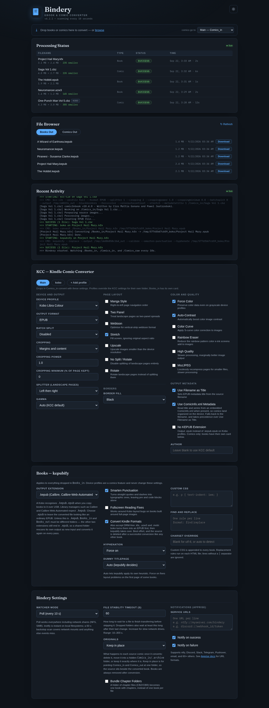

<p align="center">
  
</p>

<p align="center"><em>Drop e-books and comics into a folder and they come out ready for your e-reader.</em></p>

<p align="center">
  <a href="https://github.com/jarynclouatre/bindery/actions/workflows/test.yml"></a>
  <a href="https://hub.docker.com/r/dinkeyes/bindery"></a>
  <a href="LICENSE"></a>
  
</p>

A self-hosted, Dockerized converter that automatically processes e-books and comics dropped into watched folders, no manual steps required.

**For Kobo users:** Converts `.epub` files to Kobo's native `.kepub` format using [kepubify](https://github.com/pgaskin/kepubify), giving you better performance and reading features than sideloaded EPUBs.

**For all devices:** Converts comic archives and PDFs (`.cbz`, `.cbr`, `.zip`, `.rar`, `.pdf`) into device-optimised files using [Kindle Comic Converter (KCC)](https://github.com/ciromattia/kcc), with full control over profile, cropping, splitting, gamma, and more.

All settings are configurable at runtime via a WebUI on port 5000, no container rebuild needed; the interface has light and dark themes that follow your system, with a header toggle to override. Supports `PUID`/`PGID` permission mapping for NAS and multi-user environments, and the image is multi-arch: it runs on x86 and ARM64, so a Raspberry Pi 4/5 or an ARM NAS works too.

**Supported devices:** Kindle, Kobo, reMarkable, and any device KCC has a profile for.

<p align="center">
  
</p>

---

## Quick Start

```bash
# 1. Copy docker-compose.yml from the repo and edit your paths
# 2. Find your user/group IDs
id
# → uid=1000(you) gid=1000(you)

# 3. Set PUID/PGID in docker-compose.yml, then start
docker compose up -d

# 4. Open the WebUI
http://<server-ip>:5000
```

---

## Folder Layout

```
bindery/
├── books_in/        ← drop .epub files here (Kobo users only)
├── books_out/       ← converted .kepub files appear here
├── comics_in/       ← drop .cbz / .cbr / .zip / .rar / .pdf here
│   ├── Some Series/ ← a folder of images becomes ONE bundled volume (subfolders = chapters)
│   └── .archive/    ← originals moved here when Originals is set to "Move to .archive"
├── comics_out/      ← converted files appear here
├── comics_raw/      ← drop a flat folder of images here; Bindery zips it to CBZ and processes it automatically
│   ├── processed/   ← original image folders moved here on success
│   └── unprocessed/ ← folders with subfolders or no images moved here
└── config/          ← settings.json, jobs.json, converted.json persisted here
```

All folders are created automatically on first run. Books keep their subfolder structure: `books_in/Tolkien/hobbit.epub` converts to `books_out/Tolkien/hobbit.kepub`. For comics it depends on what a folder contains: a folder of **images** is treated as one volume (subfolders become chapters, output named after the folder), while archives (loose or inside folders) convert individually with subfolder structure preserved, unless **Bundle Chapter Folders** is enabled, which turns a folder of chapter archives into one volume too.

---

## docker-compose.yml

```yaml
services:
  bindery:
    image: dinkeyes/bindery:latest
    container_name: bindery
    ports:
      - "5000:5000"
    environment:
      - PUID=1000   # replace with your uid
      - PGID=1000   # replace with your gid
      # - SKIP_CHOWN=true   # uncomment for NFS/SMB volumes the container can't chown (e.g. unprivileged LXC)
    volumes:
      - ./config:/app/config
      - /path/to/books_in:/Books_in
      - /path/to/books_out:/Books_out
      - /path/to/comics_in:/Comics_in
      - /path/to/comics_out:/Comics_out
      - /path/to/comics_raw:/Comics_raw
    restart: unless-stopped
    logging:
      driver: "json-file"
      options:
        max-size: "10m"
        max-file: "3"
```

---

## WebUI

The WebUI at port 5000 gives you full control over Bindery without touching config files or restarting the container.

### Upload

Drag files anywhere onto the page, or tap the strip under the header on a phone, and they land in the right watch folder automatically: `.epub` goes to `Books_in`, comics to `Comics_in` or a device profile folder of your choice. Conversion starts on the next scan, and the status table picks the job up like any other drop. No Samba, SFTP, or shell access needed.

### Processing Status

A live table shows every conversion job: filename, type, status (`queued` / `processing` / `success` / `failed`), timestamp, and elapsed time. Successful conversions also show the before → after size and percentage saved, and jobs from a device profile folder carry the profile's tag. Failed jobs show a **Retry** button that re-queues the file immediately. Job history is persisted in `/app/config/jobs.json` and survives container restarts (capped at 500 entries; oldest completed jobs are pruned first).

### File Browser

Browse and download files directly from `Books_out` and `Comics_out` without needing Samba, SSH, or any other file access method. Switch between the two output folders using the tab buttons. Files are listed newest first with size and date.

### Notifications

Bindery can send push notifications on conversion success and/or failure via [Apprise](https://github.com/caronc/apprise), which supports 60+ services including ntfy, Discord, Slack, Telegram, Pushover, and email. Enter one URL per line in the Service URLs box under Bindery Settings, check which events you want, and save.

Example URLs:
```
ntfy://your-ntfy-server.com/bindery
ntfy://bindery-alerts          ← uses the free ntfy.sh public server
discord://webhook_id/token
tgram://bot_token/chat_id
```

Full URL formats for every supported service are in the [Apprise docs](https://github.com/caronc/apprise/wiki).

---

## Device Profiles

One Bindery can serve every reader in the house. Create a profile in the WebUI (the pills at the top of the KCC settings card), name it after the device (`kobo`, `kindle`, whatever you like), and Bindery creates `Comics_in/<name>` and `Comics_out/<name>` for it. Anything dropped into a profile's folder converts with that profile's KCC settings and comes out in its own output folder, so nothing gets mixed together.

A few rules that keep it predictable:

- Drops in the root of `Comics_in` always use the main settings: creating profiles changes nothing for anyone who ignores them.
- A profile starts as a copy of the main settings; switch to its pill, adjust, and save. Settings a profile has never saved follow the main settings automatically.
- Watcher mode, notifications, the Originals setting, and the other Bindery settings are shared: profiles override KCC conversion settings only. Books have no KCC settings, so `Books_in` is unaffected.
- Deleting a profile never touches its folders or files; future drops there simply convert with the main settings.
- Folder jobs and Bundle Chapter Folders work inside profile folders exactly as they do in the root.

---

## KCC Settings

All KCC settings are configured in the WebUI, and each option includes a description inline. The most important settings to get right for your setup are:

- **Device Profile**: match your exact device for correct resolution. Default is `KoLC` (Kobo Libra Colour).
- **Output Format**: `EPUB` (default) or `CBZ`. For Kindle devices, convert to EPUB and deliver with [Send to Kindle](https://www.amazon.com/sendtokindle). MOBI and KFX were removed in v3.4.0: MOBI needs Amazon's abandoned kindlegen binary and KFX a Calibre plugin, neither of which can ship in this image, so those conversions always failed.
- **Manga Style**: enables right-to-left page order; enable for manga.
- **Stretch**: fills the screen ignoring aspect ratio; on by default.
- **Splitter**: controls how landscape pages are split. Use `Right then left` for manga.

When **Device Profile** is set to **Generic / Custom**, width and height fields appear for custom resolutions.

---

## Books Settings

Books dropped into `Books_in` are converted by [kepubify](https://github.com/pgaskin/kepubify), which has its own settings card in the WebUI. KCC settings and device profiles are a comics feature and never affect books.

| Setting | Default | Notes |
|---------|---------|-------|
| Output Extension | `.kepub` | `.kepub` is what Calibre and Calibre-Web-Automated expect when ingesting. `.kepub.epub` is what a Kobo recognises when you copy books to it over USB. `.epub` leaves the converted file looking like an ordinary EPUB. Unless this is `.kepub`, `Books_in` and `Books_out` must be different folders: the other two extensions still end in `.epub`, so a shared folder rescans its own output as new input and converts it again on every pass. |
| Smarten Punctuation | off | Converts straight quotes and dashes to typographic ones, leaving `pre` and `code` blocks alone. |
| Hyphenation | `Auto` | Force hyphenation on or off instead of leaving the book as it is. |
| Dummy Titlepage | `Auto` | Auto uses kepubify's heuristic. Force on fixes layout problems on the first page of some books. |
| Fullscreen Reading Fixes | off | Works around Kobo layout bugs on books built around full-page images. |
| Custom CSS | *(blank)* | Appended to every converted book. |
| Find and Replace | *(blank)* | One `find\|replace` rule per line, applied to each HTML file in the book. Lines without a separator are ignored, because kepubify aborts the whole conversion on a malformed rule. |
| Charset Override | *(blank)* | Blank uses utf-8. Set `auto` to detect the charset from the content. |

---

## Bindery Settings

| Setting | Default | Notes |
|---------|---------|-------|
| Watcher Mode | `poll` | `poll` scans every 10 s and works everywhere including NFS/SMB. `inotify` detects files instantly on local filesystems, with a 60 s backstop scan covering network mounts and mid-transfer folders. Requires a container restart to take effect. |
| File Stability Timeout | `60` s | How long Bindery waits for a file to finish transferring before skipping it. Dropped folders also wait at least this long after their last change before converting. Increase for slow network drives. Range: 10–300 s. |
| Notifications (Apprise) | *(blank)* | One Apprise service URL per line. Leave blank to disable notifications. See [Apprise docs](https://github.com/caronc/apprise/wiki) for URL formats. |
| Originals | `delete` | What happens to a source comic after it converts: **Delete** it (the default), **Move** it to `Comics_in/.archive` (subdirectory structure mirrored), or **Keep in place**, which leaves it exactly where it is so it can sit beside the converted book when `Comics_in` and `Comics_out` point at one folder. In Keep-in-place mode Bindery records what it has already converted, so a kept source is never re-converted on the next scan (a timestamp touch from a library manager doesn't count) and re-converts only when you replace it with a changed copy, in which case the new book replaces the earlier converted one. No effect on book conversions. |
| Bundle Chapter Folders | disabled | When enabled, a folder of chapter archives (`.cbz`/`.cbr`/`.zip`/`.rar`) dropped into `Comics_in` converts as **one volume** with a chapter per archive, in natural order (`ch2` before `ch10`). When disabled (the default), such folders convert file-by-file as before. Folders containing PDFs or loose images alongside archives always convert file-by-file. |

---

## Behaviour

- Bindery watches `/Books_in`, `/Comics_in` and `/Comics_raw` using either **poll** mode (every 10 s, NAS/SMB/NFS compatible) or **inotify** mode (instant on local filesystems, with a 60 s backstop scan for anything events miss).
- Each file gets a per-file lock so the same file is never processed twice concurrently.
- Subfolder structure is preserved for individually converted files: `Comics_in/Marvel/issue01.cbz` converts to `Comics_out/Marvel/issue01.kepub`, and books work the same way. Device profile folders mirror too: `Comics_in/kobo/x.cbz` comes out in `Comics_out/kobo/`.
- A folder of images dropped into `Comics_in` is one bundled job: a single volume named after the folder, with subfolders as chapters. With **Bundle Chapter Folders** enabled, a folder of chapter archives works the same way: one volume, a chapter per archive. Processing starts once nothing inside has changed for the File Stability Timeout (minimum 30 s).
- On success: converted file is moved to the output folder. The source is then deleted, moved to `Comics_in/.archive`, or left exactly where it is, according to the **Originals** setting.
- On failure: the source is renamed to `<filename>.failed` and will not be retried automatically. Use the Retry button in the WebUI to re-queue it.
- Raw image folders in `Comics_raw` are held until stable (no file changes for 30 s) before processing begins.
- Live logs are shown in the WebUI and streamed to `docker logs`.
- The WebUI has no authentication: keep port 5000 on your LAN or behind a VPN; don't forward it to the internet.

---

## Use Cases

Bindery fits anywhere in a self-hosted media pipeline:

- **[Calibre-Web Automated](https://github.com/crocodilestick/Calibre-Web-Automated)**: set `books_out` as the CWA ingest folder and converted `.kepub` files are imported to your library automatically
- **[Calibre](https://calibre-ebook.com/) auto-add**: point Calibre's Auto Add folder at `books_out` or `comics_out` for hands-free import
- **Cloud sync**: use rclone to push converted files to Google Drive, Dropbox, or any cloud storage automatically

---

## rclone Auto-Sync

Install rclone, configure a remote (`rclone config`), then run on a schedule with cron:

```bash
crontab -e
```

```
*/15 * * * * rclone sync /path/to/bindery/comics_out gdrive:Comics --log-file=/var/log/rclone-comics.log
*/15 * * * * rclone sync /path/to/bindery/books_out gdrive:Books --log-file=/var/log/rclone-books.log
```

Full setup instructions including systemd service and provider-specific remote configuration are at [rclone.org/docs](https://rclone.org/docs/).

---

## Dashboard integration

Bindery exposes a small JSON endpoint at `/api/stats` for home-lab dashboards:

```json
{
  "converted": 1240,
  "bytes_saved": 3221225472,
  "bytes_saved_human": "3.0 GB",
  "queued": 0,
  "processing": 1,
  "failed": 0,
  "last_conversion": "2026-07-15T00:31:44Z"
}
```

`converted` and `bytes_saved` are lifetime totals kept across restarts; the rest reflect the live queue.

For **[Homepage](https://gethomepage.dev/)**, add a custom API widget:

```yaml
- Bindery:
    icon: mdi-book-cog
    href: http://bindery-host:5000
    widget:
      type: customapi
      url: http://bindery-host:5000/api/stats
      mappings:
        - field: converted
          label: Converted
        - field: bytes_saved_human
          label: Saved
        - field: processing
          label: Working
```

For **[Uptime Kuma](https://github.com/louislam/uptime-kuma)**, point an HTTP monitor at `/health`, which returns `{"status": "ok"}`.

## Updating

```bash
docker compose pull && docker compose up -d
```
